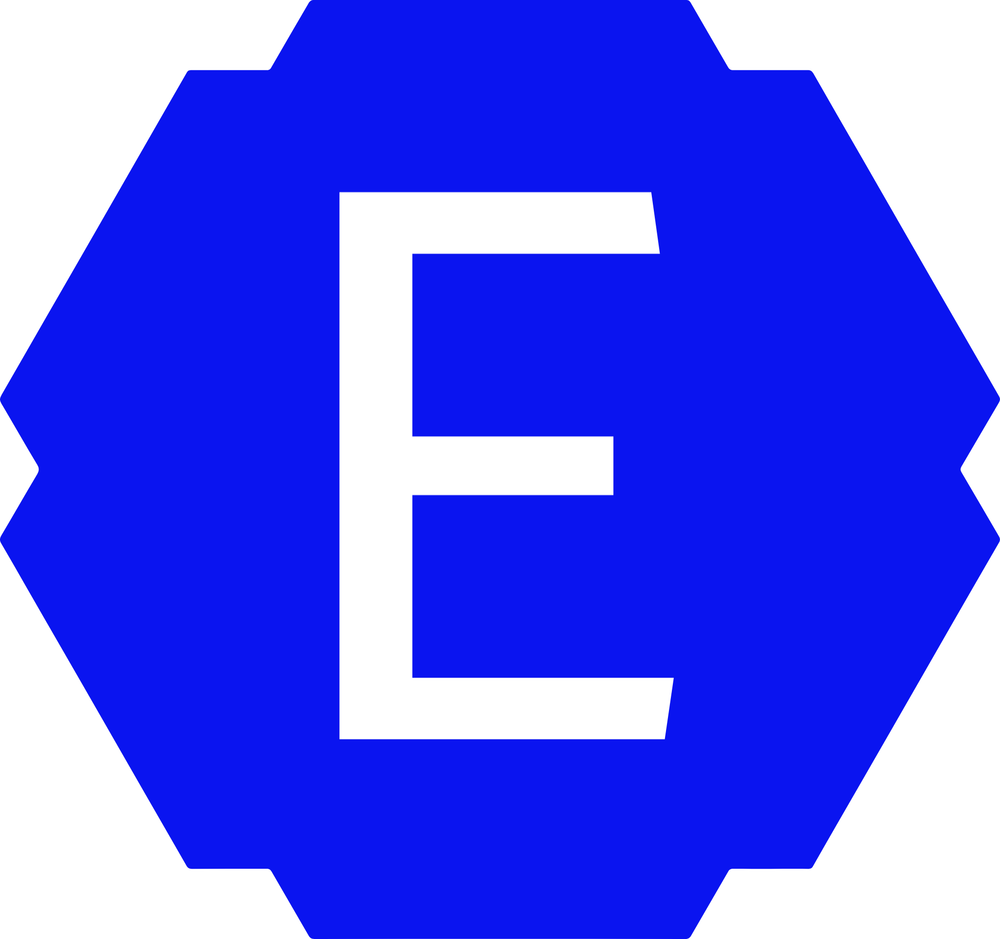

<h1 align="center">🌀 LUR.E</h1>
<p align="center"></p>

<p align="center">
  <a href="https://www.npmjs.com/package/@fest-lib/lure"></a>
  <a href="LICENSE"></a>
  <a href="https://github.com/fest-live/lur.e"></a>
</p>

`@fest-lib/lure` — level 2 reactive DOM. Binds `@fest-lib/object` refs to real nodes (`E`, `H`, `M`, `Q`, `T`, `C`, `S`), forms, overlays, and drag. Web components and CSS-in-JS (`S`) are first-class.

```text
core · dom · object · uniform
 └── fest/lure        ← you are here
      └── icon · image · veela · fl-ui
```

## Install

```bash
npm install @fest-lib/core @fest-lib/dom @fest-lib/object @fest-lib/uniform @fest-lib/lure
```

Peers: `core`, `dom`, `object`, `uniform` (`>=0.1.0`). ESM, `sideEffects: true`.

```ts
import { E, H, M, Q, T } from "@fest-lib/lure";
import { observe, iterated } from "@fest-lib/object";

const el = E("div", {
    attributes: { id: "app" },
    classList: new Set(["box"]),
    style: { padding: "8px" },
    on: { click: () => console.log("hi") }
}, ["Hello"]);
document.body.append(el as Node);
```

## Factory map

| API | Role |
| --- | --- |
| `E(tag \| node, props, children)` | create / wrap + bind |
| `H\`html\`` / `H("<div>")` | parse HTML or tagged template |
| `M(list, mapFn)` | reactive list → nodes |
| `Q(selector, root?)` | live query wrapper |
| `T(string \| ref)` | text node |
| `C(ref, factory)` | swap node when ref changes |
| `S\`css\`` | controllable stylesheet |

`H` prefixes: `attr:*` attribute · `prop:*` property · `on:*` / `@*` event · `ref` / `ref:*` assign.

```ts
const items = iterated(["A", "B"]);
const list = H`<ul>${M(items, (x) => H`<li>${x}</li>`)}</ul>`;
items.push("C"); // DOM updates
```

## Triggers & overlays

Use these instead of ad-hoc listeners:

```ts
import {
    withTriggerModifiers,
    bindOutsideDismiss,
    resolvePlacement,
    registerTransientOverlay
} from "@fest-lib/lure";
```

- **TriggerCore** — `once` / `debounce` / `prevent` / `stop` / `capture` / `passive` via `withTriggerModifiers` and `E({ on })` tuples.
- **bindOutsideDismiss** — composed path, panel roots, Escape, idempotent cleanup.
- **resolvePlacement** / `placeOverlay` — CSS-anchor with JS fallback.
- **registerTransientOverlay** — same-kind overlays close LIFO.

Forms: `formLink` / `bindForms` / `FormBinding` (`bindFormControl`, `formRef`). Mount lifecycle is opt-in (`bindWhileConnected`).

```ts
import { bindDraggable } from "@fest-lib/lure";
bindDraggable(target, () => console.log("drag end"));
```

## Also in the package

OPFS / file helpers (`pickFile`, `saveFile`, markdown asset bind), clipboard, history, scrollbar, voice input, theme / color engines. Subpath: `@fest-lib/lure/markdown-assets`. JSX: `jsxFactory` → `createElement` (`@fest-lib/lure/src/lure/node/jsx-runtime`).

## Workspace

```bash
cd modules/projects/lur.e
npm test                 # linker, interaction, placement, overlay-host, trigger-core, form-binding
npm run demo
npm run build
npm run publish
```

Typedoc: `npm run docs:md`. License: [MIT](LICENSE).
